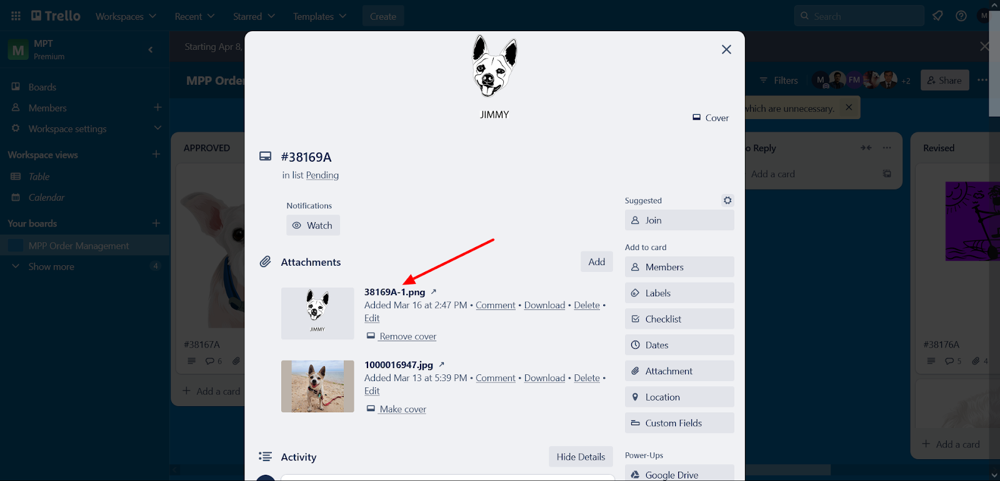
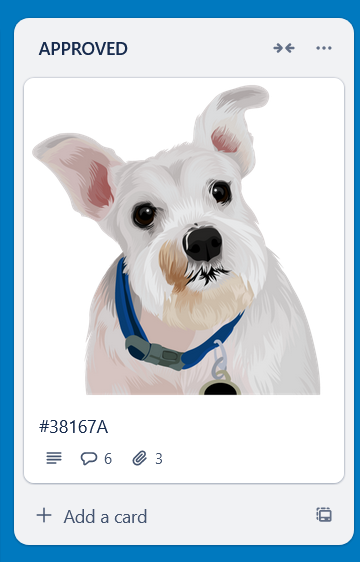
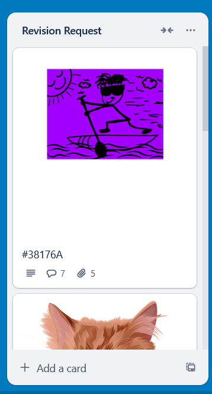
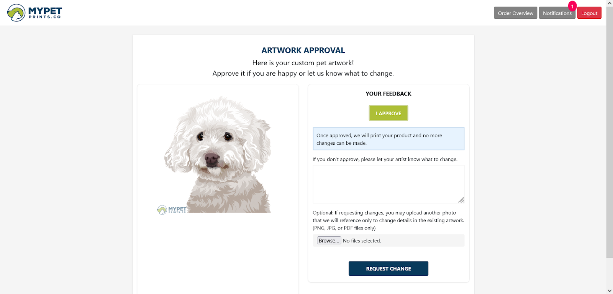
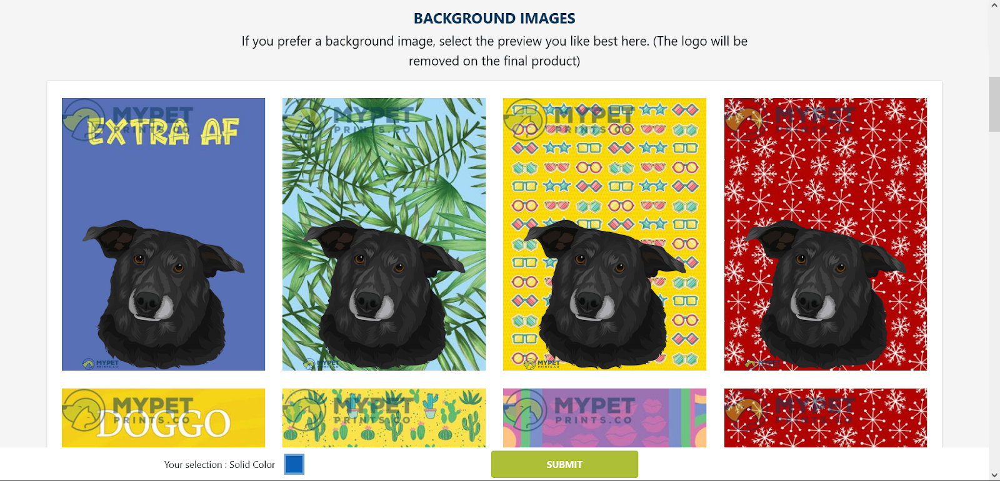
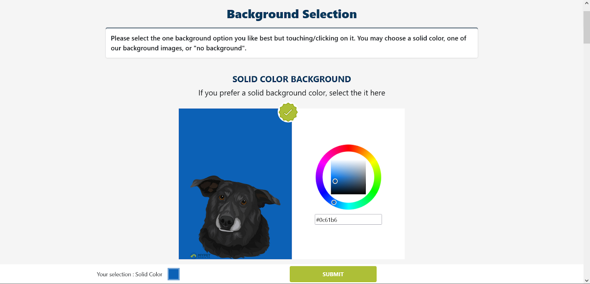

# 🐶 MyPetPrints – Artwork Approval Automation System

## 📌 Project Type
Enterprise Workflow Automation  
Shopify + Custom PHP Backend + Trello API + Cron-Based Escalation Engine  

---

## 🚀 Overview

MyPetPrints is a fully automated artwork approval workflow system built for a Shopify-based custom pet portrait eCommerce store.

The system integrates:

- Shopify (Order Management)
- Custom PHP Admin Panel
- MySQL Database
- Trello Board (Workflow Tracking)
- Pabbly Automation
- Cron Jobs (Process Engine)
- Automated Email System

The objective was to eliminate manual coordination between customers, artists, and administrators by automating the entire artwork lifecycle.

---

## 🎯 Business Problem

Before automation:

- Trello cards were created manually
- Approval follow-ups were manual
- Revision requests required admin coordination
- No automated escalation for non-response
- Delays in production workflow

This resulted in:

- Slower order turnaround
- High admin workload
- Missed customer follow-ups
- Lack of workflow visibility

---

## 💡 Solution

Built a centralized automation engine that:

1. Captures Shopify orders via webhook
2. Inserts order into custom admin system
3. Automatically creates Trello workflow card
4. Syncs artwork upload status
5. Allows customer approval or revision request
6. Moves Trello cards automatically
7. Sends reminder emails
8. Auto-approves after 72 hours if no response

The system eliminates manual intervention after artwork upload.

---

## 🏗 System Architecture

```
Customer (Shopify Store)
│
▼
Shopify Order Webhook
│
▼
Custom PHP Admin Panel
│
├── MySQL Database
├── Pabbly Workflow
│ │
│ ▼
│ Trello Board
│
▼
Cron Job Engine (5 min interval)
│
├── Approval Email Trigger
├── Revision Movement
├── Background Timeout Check
├── Auto Approval (72h)
└── Reminder Email (18h interval)
```

---

## 🔄 Workflow Lifecycle

### Trello Lists Used

- MPP Orders
- Revision Request
- Revised
- Approved
- Rejected
- No Reply

Cards automatically move based on:

- Artwork upload
- Customer approval
- Revision request
- 72-hour timeout
- Background selection logic

---

## ⚙️ Tech Stack

| Layer | Technology |
|-------|------------|
| eCommerce | Shopify |
| Backend | PHP |
| Database | MySQL |
| Workflow Automation | Trello API |
| Process Automation | Pabbly |
| Scheduling | Cron Jobs |
| Authentication | Order + Email Login |
| Communication | Email Automation |

---

## 🔔 Automation Logic

### ✔ Cron Job 1 – Pending Artwork Sync
Runs every 5 minutes:
- Fetch Trello cards
- Check artwork upload
- Sync with admin panel
- Send approval email if required

### ✔ Cron Job 2 – Auto Approval
If customer does not approve artwork within 72 hours:
- Automatically approve artwork
- Move Trello card to Approved

### ✔ Cron Job 3 – Background Timeout
If background not selected within 72 hours:
- Move card to "No Reply"

### ✔ Cron Job 4 – Reminder Emails
If no response:
- Send reminder email every 18 hours
- Repeat twice before escalation

---

## 👤 Customer Experience Flow

1. Customer logs in using Order Number + Email
2. Reviews uploaded artwork
3. Approves artwork OR requests revision
4. Selects background (if purchased)
5. Workflow continues automatically

No admin involvement required once artwork is uploaded.

---

## 📊 Business Impact

- 🔽 70% reduction in manual admin workload
- ⚡ Faster artwork approval cycle
- 📈 Improved order turnaround time
- 🔄 Fully scalable automation framework
- 📌 Transparent workflow visibility

---

## 👨‍💻 My Role

- System Architecture Design
- Shopify Webhook Integration
- Backend Development (PHP)
- MySQL Database Design
- Trello API Automation
- Cron-Based Escalation Logic
- Workflow Engineering
- End-to-End Automation Implementation

---

## 🖼 Screenshots

### 1️⃣ Trello Workflow Automation  
_(Blurred for confidentiality)_  




### 2️⃣ Customer Artwork Approval Portal  




### 3️⃣ Cron Automation Engine  


---

## 📁 Repository Structure (Case Study Only)

This repository contains documentation and screenshots only.

```
mypetprints-case-study/
│
├── README.md
└── screenshots/
    ├── trello-workflow.png
    ├── customer-approval.png
    ├── trello-workflow-approved-card.png
    ├── trello-workflow-card.png
    ├── background-list.png
    ├── customer-background-selected.png
    └── cron-automation.png 
```

---

## 🔐 Source Code Notice

This is a public case study repository.

The production source code is maintained in a private repository due to:

- Client confidentiality
- Business workflow protection
- API credential security
- Production infrastructure sensitivity

Technical discussion and architectural walkthrough available upon request.

---

## 🌐 Portfolio

Live Portfolio:  
https://mukeshprajapat026.github.io/

---

## 📬 Contact

Mukesh Prajapat  
Full Stack Developer  
Workflow Automation & eCommerce Systems Specialist  

---

> Designed and engineered as a scalable automation framework for high-volume custom artwork production systems.